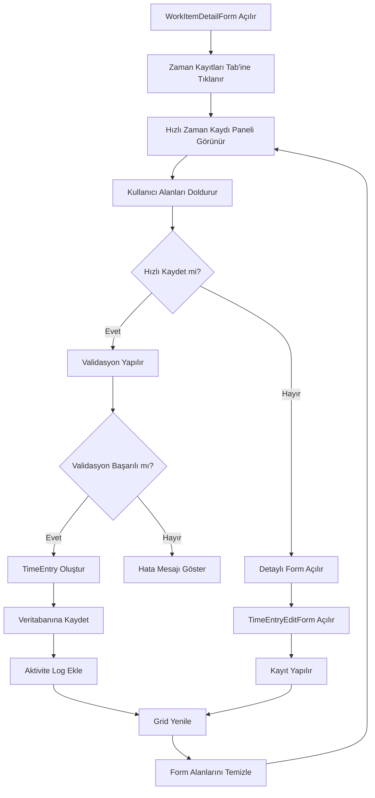

# Hızlı Zaman Kaydı Ekleme Özelliği - Plan

## Amaç
İş detay ekranında (WorkItemDetailForm), zaman kayıtları bölümü açıldığında hızlı bir şekilde zaman kaydı eklemeyi sağlayan bir yapı oluşturmak.

## Mevcut Durum
- WorkItemDetailForm'da zaman kayıtları `tabPageTimeEntries` tab'inde `gridTimeEntries` grid'inde gösteriliyor
- Zaman kaydı eklemek için tam form olan `TimeEntryEditForm` açılıyor
- Kullanıcı için hızlı erişim imkanı yok

## Hedeflenen Özellik

### 1. Hızlı Zaman Kaydı Paneli
Zaman kayıtları tab'ının üst kısmında kompakt bir panel eklenecek.

#### Panel İçeriği:
| Alan | Kontrol | Varsayılan Değer |
|------|---------|------------------|
| Tarih | DateEdit | DateTime.Now |
| Süre (Dakika) | SpinEdit | 30 |
| Aktivite Tipi | ComboBoxEdit | "İş" (Work) |
| Konu | TextEdit | Boş |

#### Ek Kontrol:
- "💾 Hızlı Kaydet" butonu
- "📝 Detaylı Ekle" butonu (tam formu açar)

### 2. UI Düzeni
```
┌─────────────────────────────────────────────────────────────────┐
│ Zaman Kayıtları                                                  │
├─────────────────────────────────────────────────────────────────┤
│ ┌─────────────────────────────────────────────────────────────┐ │
│ │ Hızlı Zaman Kaydı Ekle                                       │ │
│ │ ┌──────────────┐ ┌─────────┐ ┌────────────────┐ ┌────────┐  │ │
│ │ │ Tarih:       │ │ 30 dk   │ │ Aktivite: İş   │ │ Konu   │  │ │
│ │ │ [dd.MM.yyyy] │ │ [Spin]  │ │ [ComboBox]     │ │ [Text] │  │ │
│ │ └──────────────┘ └─────────┘ └────────────────┘ └────────┘  │ │
│ │ [💾 Hızlı Kaydet]  [📝 Detaylı Ekle]                        │ │
│ └─────────────────────────────────────────────────────────────┘ │
│                                                                 │
│ ┌─────────────────────────────────────────────────────────────┐ │
│ │ Zaman Kayıtları Grid                                         │ │
│ │ ...                                                           │ │
│ └─────────────────────────────────────────────────────────────┘ │
└─────────────────────────────────────────────────────────────────┘
```

### 3. Veri Kayıt Mantığı
Hızlı kayıt sırasında:
- `WorkItemId` = Mevcut iş öğesi ID'si (otomatik)
- `ProjectId` = Mevcut iş öğesinin projesi (otomatik)
- `EntryDate` = Seçilen tarih
- `DurationMinutes` = Girilen süre
- `ActivityType` = Seçilen aktivite tipi
- `Subject` = Girilen konu
- `Description` = Boş (opsiyonel - detaylı formda doldurulabilir)
- `CreatedBy` = Environment.UserName
- `CreatedAt` = DateTime.Now

### 4. Aktivite Tipleri
- "İş" (Work)
- "Telefon Görüşmesi" (PhoneCall)
- "Toplantı" (Meeting)
- "Mola" (Break)
- "Diğer" (Other)

### 5. Validasyon Kuralları
- Tarih boş olamaz
- Süre 0'dan büyük olmalı (max 1440 dakika = 24 saat)
- Aktivite tipi seçilmeli
- Konu boş olamaz

## Uygulama Adımları

### Adım 1: Designer Dosyasında Panel Ekleme
`WorkItemDetailForm.Designer.cs` dosyasına:
- `groupQuickTimeEntry` GroupControl ekle
- `dtQuickEntryDate` DateEdit ekle
- `spinQuickDurationMinutes` SpinEdit ekle
- `cmbQuickActivityType` ComboBoxEdit ekle
- `txtQuickSubject` TextEdit ekle
- `btnQuickSave` SimpleButton ekle
- `btnDetailedEntry` SimpleButton ekle

### Adım 2: Kod Dosyasında Mantık Ekleme
`WorkItemDetailForm.cs` dosyasına:
- `InitializeQuickTimeEntryPanel()` metodu ekle
- `btnQuickSave_Click` event handler ekle
- `btnDetailedEntry_Click` event handler ekle
- `QuickSaveTimeEntry()` metodu ekle
- `ValidateQuickTimeEntry()` metodu ekle

### Adım 3: Aktivite Kaydı
Zaman kaydı eklendiğinde aktivite logu ekle:
- Aktivite tipi: "FieldUpdate"
- Açıklama: "Zaman kaydı eklendi: X dakika - [Konu]"

### Adım 4: Grid Yenileme
Kayıt sonrası:
- `LoadTimeEntries()` metodunu çağır
- Grid'i yenile
- Form alanlarını temizle (konu hariç)

## Mermaid Diyagramı - Akış



## Ek Özellikler (Opsiyonel)
1. **Klavye Kısayolları**: Enter ile hızlı kaydetme
2. **Son Kullanılan Değerler**: Son kullanılan aktivite tipini hatırlama
3. **Hızlı Şablonlar**: Önceden tanımlı şablonlar (örn: "Telefon görüşmesi - 15 dk")
4. **Toplu Kayıt**: Aynı konu ile birden fazla kayıt ekleme

## Test Senaryoları
1. Geçerli verilerle hızlı kayıt yapma
2. Boş/eksik verilerle hata kontrolü
3. Detaylı forma geçiş yapma
4. Kayıt sonrası grid yenileme kontrolü
5. Aktivite logu oluşturma kontrolü
